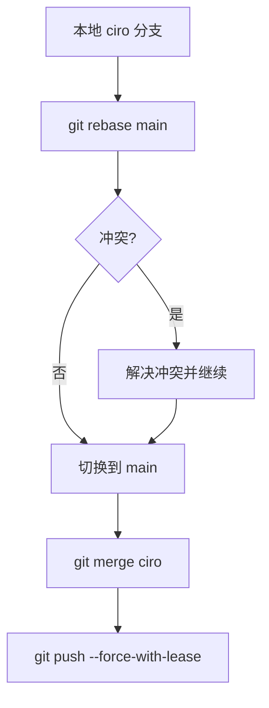

要将当前分支 `ciro` 的更新通过 **Rebase** 方式同步到远程 `main` 分支，需按以下步骤操作：

---

### **完整操作流程**

#### **1. 确保本地仓库最新**
```bash
# 拉取远程 main 分支最新代码
git checkout main
git pull origin main
```

#### **2. 切换到 ciro 分支并 Rebase**
```bash
# 回到你的开发分支
git checkout ciro

# 将 ciro 的提交变基到最新 main 分支
git rebase main
```

#### **3. 处理 Rebase 冲突（如有）**
- 若出现冲突，按提示解决冲突文件
- 标记冲突已解决并继续：
  ```bash
  git add <冲突文件>
  git rebase --continue
  ```

#### **4. 合并到 main 分支**
```bash
# 切换到 main 分支
git checkout main

# 合并 ciro 分支（此时已是线性历史）
git merge ciro
```

#### **5. 推送到远程 main 分支**
```bash
# 强制推送（需确保你有权限！）
git push origin main --force-with-lease
```

---

### **关键注意事项**

| 操作步骤 | 风险 | 解决方案 |
|---------|------|----------|
| **强制推送** (`--force`) | 覆盖远程历史可能导致团队协作问题 | 使用 `--force-with-lease` 更安全 |
| **Rebase 冲突** | 代码冲突可能导致流程中断 | 提前在本地解决所有冲突 |
| **权限问题** | 远程 main 分支可能受保护 | 改用 Pull Request 合并（推荐） |

---

### **替代方案（推荐使用 Pull Request）**
如果远程 `main` 分支受保护，更安全的流程是：
```bash
# 推送 ciro 分支到远程
git push origin ciro

# 在 Git 平台（GitHub/GitLab）创建 Pull Request
# 选择合并方式为 "Rebase and Merge"
```

---

### **操作流程图**


---

### **补充说明**
1. **Rebase 与 Merge 的区别**：
   - **Rebase**：重写提交历史，保持线性
   - **Merge**：保留分支结构，生成合并提交

2. **何时用 Rebase**：
   - 个人分支整理历史
   - 确保主分支提交线性清晰

3. **何时用 Merge**：
   - 团队协作时保留完整分支历史
   - 主分支需要记录合并节点

---

执行前请确保：
1. 已备份重要代码
2. 确认远程 `main` 分支允许强制推送
3. 团队成员知晓你的操作（如果是共享分支）